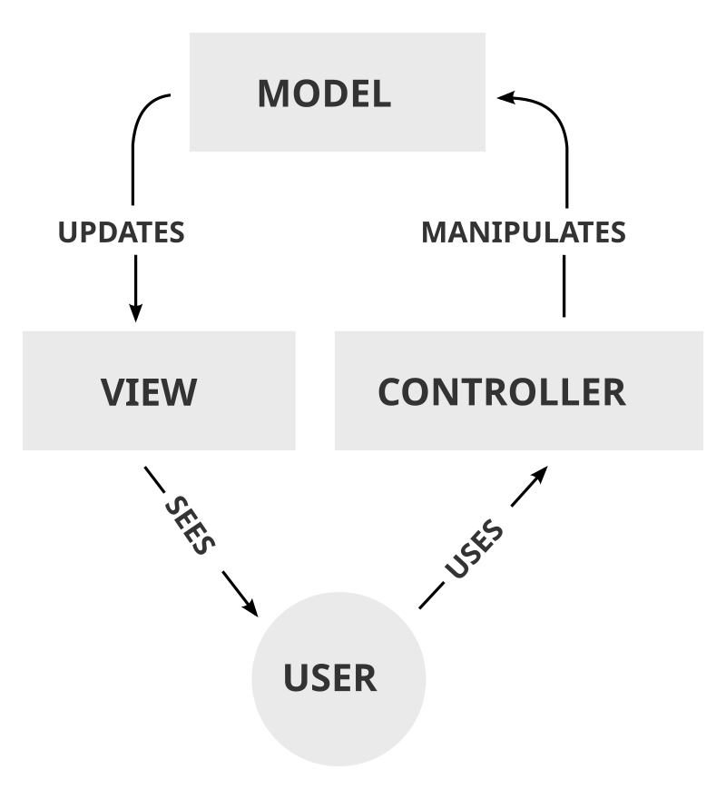
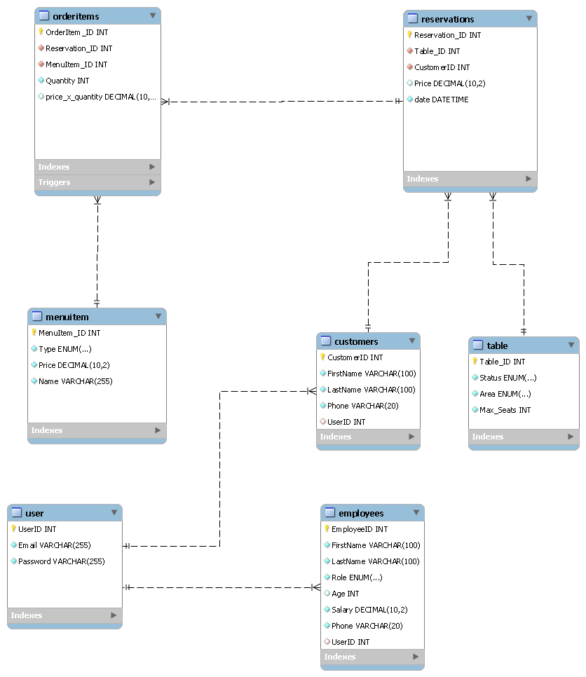

# 🍽️ Restaurant Management System Documentation

## 📌 Overview
The **Restaurant Management System** is a **JavaFX-based** desktop application designed to streamline restaurant operations. It allows **customers** to make reservations and place orders, **chefs** to track and prepare meals, **waiters** to manage table service, and **managers** to oversee restaurant operations, employee management, and order tracking.

The system follows the **MVC (Model-View-Controller) architecture pattern**, ensuring a **modular, scalable, and maintainable** codebase. It uses **JavaFX for UI**, **MySQL for database management**, and **JDBC for data persistence**.

---

## 📌 Software Architecture & Design Patterns

### 🛠 Architecture Pattern: MVC (Model-View-Controller)

The system follows the **MVC architectural pattern**, separating concerns to improve **maintainability, scalability, and testability**.

#### 🔹 MVC Breakdown in This Project:

| **Layer** | **Description** | **Files** |
|-----------|---------------|-----------|
| **Model** | Represents the **business logic** and data structure. | `User.java`, `Customer.java`, `Employee.java`, `Reservation.java`, etc. |
| **View** | Handles the **UI layout and design** using JavaFX FXML. | `Login.fxml`, `Signup.fxml`, `Manager_Dashboard.fxml`, etc. |
| **Controller** | Manages **user interactions**, updates the model, and refreshes the view. | `Login_Controller.java`, `Customer_Dashboard_Controller.java`, etc. |

📌 **Example of MVC in Action**:  
✅ When a **customer reserves a table**:
- The **Controller** (`Customer_Dashboard_Controller.java`) handles the input and calls `Reservation.java` (**Model**) to process the request.
- The **View** (`Customer_Dashboard.fxml`) updates to reflect the reservation status.

---

### 🛠 Design Patterns Used

#### 1️⃣ Singleton Pattern (Creational Design Pattern)
- Ensures that only **one database connection** exists throughout the application.
- Prevents **multiple database connections**, improving **performance and resource management**.

#### 2️⃣ Data Access Object (DAO) Pattern (Structural Design Pattern)
- Separates database operations from business logic.
- Provides a structured way to interact with the database.
- Enhances code reusability and maintainability.

## 📊 Database Schema & ERD
The database is designed using a **relational schema** with well-defined **foreign key relationships** to ensure **data integrity**. The key entities include:

- **Users**: Stores login credentials for all users.
- **Customers**: Contains customer details and their reservations.
- **Employees**: Stores employee information, including roles.
- **Reservations**: Handles table reservations.
- **Orders**: Tracks customer orders.
- **Menu Items**: Stores restaurant menu items.
- **Tables**: Manages table availability and seating.

📌 **Entity-Relationship Diagram (ERD):**

## 🚀 Features
- ✅ **User Authentication** (Secure login and role-based access)
- ✅ **Table Reservation System** (Real-time availability tracking)
- ✅ **Menu & Order Management** (Track, update, and process orders)
- ✅ **Manager Dashboard** (Employee & revenue tracking)

## 🛠️ Technologies Used
| Technology | Purpose |
|------------|---------|
| **JavaFX** | GUI Development |
| **MySQL** | Database Management |
| **JDBC** | Database Connectivity |
| **FXML** | UI Layout Separation |
| **DAO Pattern** | Database Abstraction |
| **Singleton Pattern** | Database Connection Handling |

## 📖 Setup & Installation
### 📌 Prerequisites
- **Java 17+ (JDK Installed)**
- **MySQL Database Server Installed**
- **JavaFX SDK Installed**

## 🎯 Conclusion
The **Restaurant Management System** is a **feature-rich, well-structured** desktop application for restaurant management...

📌 **Note:** This project is developed for **Educational Purposes** and is not production-ready. While it demonstrates key concepts such as **MVC, Singleton, and DAO patterns**, significant enhancements are needed for real-world deployment, including advanced security measures, scalability improvements, and comprehensive testing.

