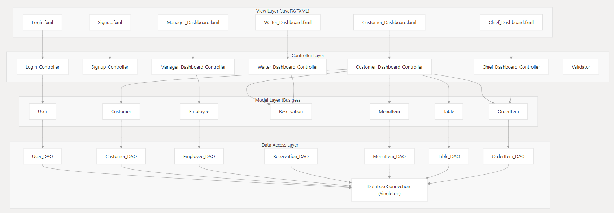
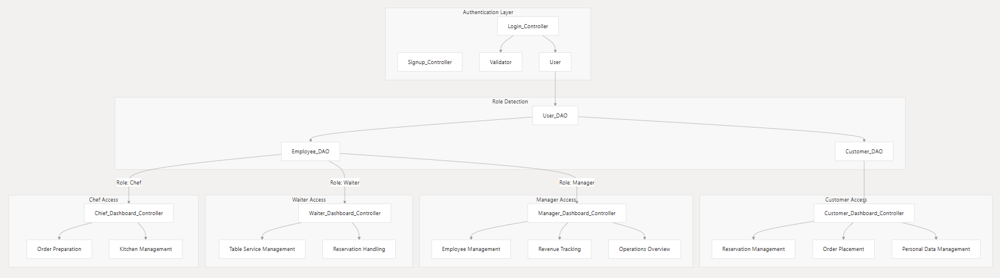
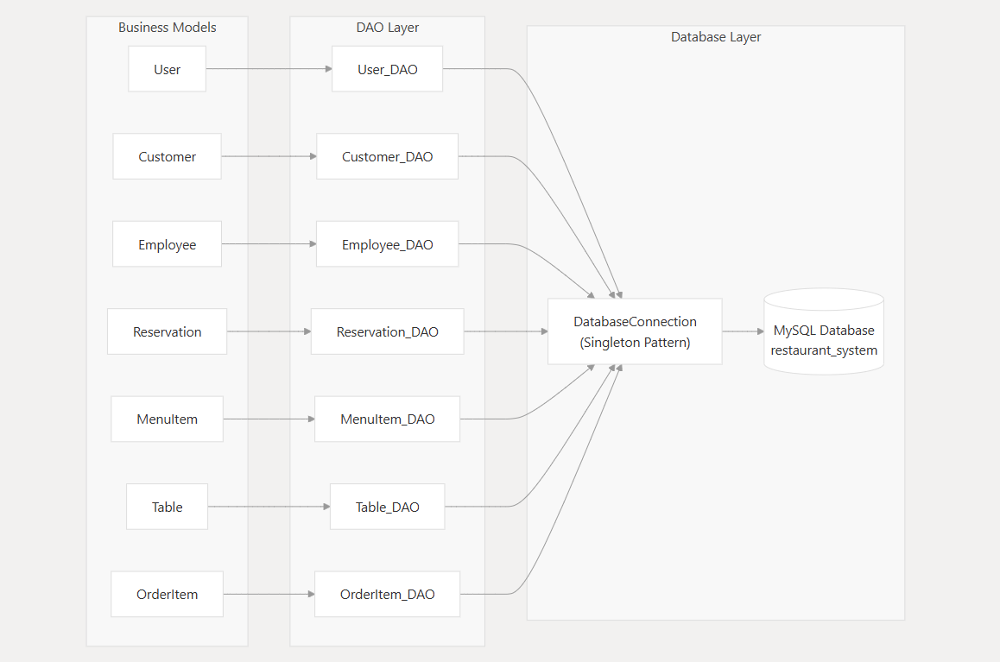

# Restaurant Management System Documentation

## 📁 Overview

This document provides a comprehensive overview of the **Restaurant Management System**, a **JavaFX-based desktop application** that streamlines restaurant operations through role-based access control and integrated business workflows.

For more details:
- [Architecture & Design Patterns](#architecture--design-patterns)
- [User Interfaces & Dashboards](#)
- [Database Design](#)

---

## 🎯 Purpose and Scope

The system is designed for educational use and follows **enterprise-level design principles**. It enables:

- Streamlined restaurant operations
- Secure, role-based access
- Clean separation of concerns via MVC architecture

---

## 🏗️ System Architecture Overview

The application implements a **layered MVC (Model-View-Controller)** architecture. Each user role is provided a tailored dashboard:

### High-Level MVC Architecture

---

## 🔄 Core Business Functions

| Function           | Description                                             | Primary Users              |
|--------------------|---------------------------------------------------------|----------------------------|
| **Table Reservation** | Real-time booking with availability tracking            | Customers, Waiters         |
| **Order Management**  | Menu browsing, order placement, preparation tracking   | Customers, Chefs, Waiters  |
| **Staff Management**  | Employee admin and role assignment                     | Managers                   |
| **Revenue Tracking**  | Financial reporting and analytics                      | Managers                   |

---

## 🧑‍💼 Role-Based Access Control

---

## ⚙️ Technology Stack

| Technology   | Version     | Purpose                                         |
|--------------|-------------|-------------------------------------------------|
| JavaFX       | Latest      | GUI framework for rich desktop applications     |
| MySQL        | 8.x         | Relational database for data persistence        |
| JDBC         | Standard    | Java Database Connectivity                      |
| Maven        | N/A         | Build tool and dependency management            |
| FXML         | Standard    | UI layout and separation from logic             |

---

## 📦 Dependencies and Configuration

Managed via **Maven**, including:

- `MySQL Connector/J`: Database connectivity
- `JavaFX controls & FXML`: GUI layout and event management
- `JUnit`: Unit testing framework

---

## 🗃️ Database Integration Architecture

Implements the **DAO (Data Access Object)** pattern to abstract business logic from database interactions.

---

## 🧱 Key Design Patterns

### 1. MVC (Model-View-Controller)

- **Models**: `User.java`, `Customer.java`, `Employee.java`, etc.
- **Views**: FXML files — `Login.fxml`, `Customer_Dashboard.fxml`, etc.
- **Controllers**: Java classes — `Login_Controller.java`, `Customer_Dashboard_Controller.java`, etc.

### 2. Singleton Pattern

- **Implementation**: `DatabaseConnection` class
- **Purpose**: Guarantees a single DB connection instance for pooling efficiency

### 3. Data Access Object (DAO)

- **Implementation**: `User_DAO`, `Customer_DAO`, etc.
- **Purpose**: Separation of business logic and database logic

---

## ✅ System Capabilities Summary

- 🔐 **Authentication System**: Role-based secure login (via `Validator` class)
- 🪑 **Reservation Management**: Real-time booking using `Reservation` and `Table` models
- 🍽️ **Order Processing**: Full order flow from customer to kitchen
- 🧑‍💼 **Staff Administration**: Manage employees and assign roles
- 💾 **Data Persistence**: Reliable MySQL storage using DAO + connection pooling

> This project demonstrates **clean code**, **scalable architecture**, and **practical restaurant workflows**, built with **educational clarity** and **real-world relevance**.

